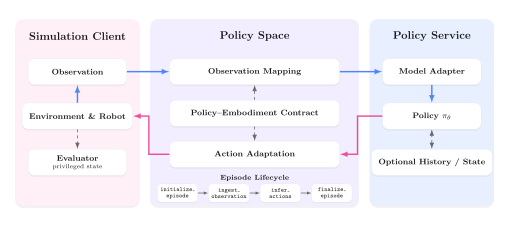

<div align="center">

# Policy Space

**面向机器人策略推理、与评测基准解耦的运行时契约。**

每个策略保留自己的软件环境，通过版本化的观测、动作与 episode 生命周期契约连接评测客户端。

[English](README.md) · [快速开始](#快速开始) · [接入策略](#接入策略) · [ManaEnv 评测](docs/manaenv-evaluation.zh-CN.md) · [契约说明](docs/contracts.zh-CN.md)

   

</div>

机器人策略通常具有不同的运行依赖、观测格式、历史与状态需求、动作表示和推理调度。Policy Space 为这些差异提供清晰的运行边界：客户端负责环境、机器人、任务和评测，策略服务保留自身的模型依赖与推理逻辑。

## 运行时架构

<p align="center">
  <a href="docs/architecture.zh-CN.md">
    
  </a>
</p>

Policy Space 统一交互边界，同时允许不同策略继续使用各自的模型框架与运行进程。可编辑的 Mermaid 版本见[架构说明](docs/architecture.zh-CN.md)。

## 核心能力

- **依赖隔离。** 每个策略可以使用自己的模型框架、CUDA 环境和 checkpoint。
- **版本化契约。** 观测、动作和机器人本体 schema 让接口约定可见、可检查。
- **面向 episode 的交互。** `initialize_episode`、`ingest_observation`、`infer_actions` 和 `finalize_episode` 统一覆盖无状态策略、带历史策略和 action chunk 推理。
- **可组合适配。** 观测映射与动作适配处理策略和机器人本体之间的表示差异，客户端无需引入模型代码。
- **明确的会话模式。** 服务可根据历史与状态需求选择独占会话或串行多路复用。
- **客户端解耦。** 同一协议可以连接 ManaEnv，也可以连接其他兼容的评测客户端。

## 快速开始

克隆仓库并安装 Policy Space：

```bash
git clone <repository-url> policy-space
cd policy-space
pip install -e .
policy-space check policies/templates/bimanual_ee/deploy.yaml
policy-space serve policies/templates/bimanual_ee/deploy.yaml
```

该模板无需 checkpoint 和 GPU，可用于验证安装、通信和生命周期接口。

下面是一个脚手架示例，用于在 OpenPI 家族下创建新的自定义 π0.5 适配包。该命令不会下载模型权重，也不会替换仓库中已有的 OpenPI 策略实现。

```bash
policy-space init pi05_custom \
  --family openpi \
  --observation bimanual_rgb_joint@1 \
  --action bimanual_joint_position@1

policy-space check policies/openpi/pi05_custom/deploy.yaml
```

- `pi05_custom`：新策略接入包的名称。
- `--family openpi`：将该策略归入 `policies/openpi/` 模型家族目录。
- `--observation bimanual_rgb_joint@1`：选择策略接收的版本化观测契约。
- `--action bimanual_joint_position@1`：选择策略输出的版本化动作契约。
- `policy-space check ...`：检查生成的部署配置，不启动策略服务。

该命令生成以下目录：

```text
policies/openpi/pi05_custom/
├── deploy.yaml
├── model.py
├── requirements.txt
└── README.md
```

接下来按照[接入策略](#接入策略)完成生成目录中的实现和配置。需要参考现有代码时，可进入 [OpenPI 策略目录](policies/openpi/README.zh-CN.md)：[`pi05_artixon_arm_6a_eef`](policies/openpi/pi05_artixon_arm_6a_eef/README.zh-CN.md) 提供 ArtiXon Arm-6A 桌面双臂接入，[`pi05_quanta_x1_whole_body`](policies/openpi/pi05_quanta_x1_whole_body/README.zh-CN.md) 提供 Quanta X1 移动操作 whole-body 接入。

## 接入策略

每个策略接入都沿用上面脚手架示例中的独立目录结构，并在 `model.py` 中实现策略所需的 episode 生命周期：

```python
from policy_space import PolicyModel


class Model(PolicyModel):
    def initialize_episode(self, episode_info=None):
        ...

    def ingest_observation(self, observation):
        ...

    def infer_actions(self):
        ...  # 返回单步动作或形状为 [T, D] 的动作序列。

    def finalize_episode(self, episode_info=None):
        ...
```

在 `deploy.yaml` 中声明模型入口、观测契约、动作契约、机器人本体和会话模式，再使用 `policy-space check` 完成检查。完整流程见[策略接入指南](docs/policy-integration.zh-CN.md)，可运行起点见[策略模板](policies/templates/README.zh-CN.md)。

## 策略目录

仓库已经包含多种策略与机器人配置：

| 策略 / 模型 | 机器人本体 | 接入实现 |
|---|---|---|
| Wall-X (wall-oss-0.5) | ArtiXon Arm-6A | [`wall_oss_05_artixon_arm_6a_eef`](policies/wallx/wall_oss_05_artixon_arm_6a_eef/README.zh-CN.md) |
| Wall-X | Quanta X1 | [`wallx_quanta_x1_whole_body`](policies/wallx/wallx_quanta_x1_whole_body/README.zh-CN.md) |
| OpenPI (π0.5) | ArtiXon Arm-6A | [`pi05_artixon_arm_6a_eef`](policies/openpi/pi05_artixon_arm_6a_eef/README.zh-CN.md) |
| OpenPI (π0.5) | Quanta X1 | [`pi05_quanta_x1_whole_body`](policies/openpi/pi05_quanta_x1_whole_body/README.zh-CN.md) |
| OpenPI (π0.5) | ArtiXon Arm-6A | [`pi05_artixon_arm_6a_joint`](policies/openpi/pi05_artixon_arm_6a_joint/README.zh-CN.md) |
| OpenPI (π0.5) | ARX R5 | [`pi05_arx_r5_eef`](policies/openpi/pi05_arx_r5_eef/README.zh-CN.md) |
| OpenPI (π0.5) | ARX R5 | [`pi05_arx_r5_joint`](policies/openpi/pi05_arx_r5_joint/README.zh-CN.md) |
| DreamZero | ArtiXon Arm-6A | [`dreamzero_artixon_arm_6a_joint`](policies/dreamzero/dreamzero_artixon_arm_6a_joint/README.zh-CN.md) |
| DreamZero | DROID | [`dreamzero_droid_joint`](policies/dreamzero/dreamzero_droid_joint/README.zh-CN.md) |
| Cosmos3 | ArtiXon Arm-6A | [`cosmos3_artixon_arm_6a_eef`](policies/cosmos3/cosmos3_artixon_arm_6a_eef/README.zh-CN.md) |
| Cosmos3 | DROID | [`cosmos3_droid_joint`](policies/cosmos3/cosmos3_droid_joint/README.zh-CN.md) |
| Cosmos3 | Franka | [`cosmos3_franka_joint`](policies/cosmos3/cosmos3_franka_joint/README.zh-CN.md) |
| DM0.5 | ArtiXon Arm-6A | [`dm05_artixon_arm_6a_joint`](policies/dm05/dm05_artixon_arm_6a_joint/README.zh-CN.md) |
| DM0.5 | ArtiXon Arm-6A | [`dm05_artixon_arm_6a_eef`](policies/dm05/dm05_artixon_arm_6a_eef/README.zh-CN.md) |
| FastWAM | ArtiXon Arm-6A | [`fastwam_artixon_arm_6a_joint`](policies/fastwam/fastwam_artixon_arm_6a_joint/README.zh-CN.md) |
| SmolVLA | Franka | [`smolvla_franka_joint`](policies/smolvla/smolvla_franka_joint/README.zh-CN.md) |

部分接入需要外部模型源码和 checkpoint。具体依赖与启动命令以各策略目录中的 README 为准，完整列表见[策略目录](policies/README.zh-CN.md)。

## 连接评测客户端

客户端使用 wire protocol v2 连接 Policy Space 服务后，依次完成元数据协商、episode 初始化、观测发送、动作请求和 episode 结束。环境推进、机器人控制、任务配置、安全限制和评分仍由客户端负责。

ManaEnv 用户可直接参考 [ManaEnv 评测指南](docs/manaenv-evaluation.zh-CN.md)。核心服务不依赖 ManaEnv，其他实现该协议的客户端也可以接入。

只需要握手检查与契约协商的客户端，可单独安装 [`packages/protocol`](packages/protocol) 中的轻量 `policy-space-protocol` 包，无需安装策略服务运行时和策略目录。

## 文档导航

| 文档 | 用途 |
|---|---|
| [策略接入](docs/policy-integration.zh-CN.md) | 添加模型适配器与部署配置 |
| [契约说明](docs/contracts.zh-CN.md) | 了解观测、动作和机器人本体 schema |
| [部署说明](docs/deployment.zh-CN.md) | 配置端点、会话、并发与运行环境隔离 |
| [ManaEnv 评测](docs/manaenv-evaluation.zh-CN.md) | 将策略服务接入闭环评测 |
| [故障排查](docs/troubleshooting.zh-CN.md) | 定位启动、schema、通信与推理问题 |
| [发布说明](docs/release.zh-CN.md) | 固定版本并发布可复现的软件版本 |

## 版本说明

Policy Space 分别管理软件包、通信协议和契约 schema 的版本：

- 软件包版本：`0.3.0`
- 通信协议版本：`2`
- 契约 schema：以 `name@version` 形式独立版本化

为了保证部署可复现，建议固定 release tag 或 commit。提交代码前请运行：

```bash
pytest -q
```

运行边界保持紧凑：策略负责模型推理，客户端负责交互与评测，Policy Space 明确定义二者之间的契约。
