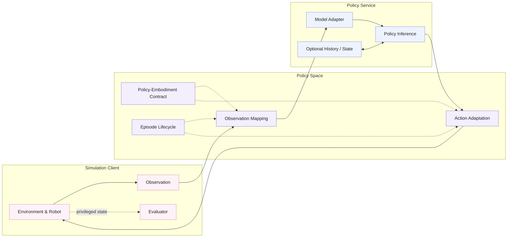

# Runtime Architecture

Policy Space defines the runtime boundary between an evaluation client and a policy service. The current reference integration uses ManaEnv as the simulation client. The client owns environment interaction, robot execution, task configuration, safety, and evaluation. The policy service owns model-specific preprocessing, inference, and optional history or state. Policy Space connects them through versioned observation, action, embodiment, and episode-lifecycle contracts.

The repository homepage uses the publication-quality vector figure in [`docs/assets/policy-space-runtime-overview.svg`](assets/policy-space-runtime-overview.svg). The Mermaid source below provides a lightweight, editable view of the same runtime structure.

## Runtime responsibilities

- **Simulation client:** produces observations, executes actions, advances the environment, and evaluates task progress.
- **Policy Space:** maps observations, adapts actions, negotiates policy-embodiment contracts, and coordinates the episode lifecycle.
- **Policy service:** converts mapped observations into model-native inputs, runs inference, and maintains optional model history or state.

Privileged simulator state is available only to the evaluator and is not sent to the policy service.

The same protocol can be implemented by robot-control clients for future real-robot deployment.

[简体中文](architecture.zh-CN.md)
