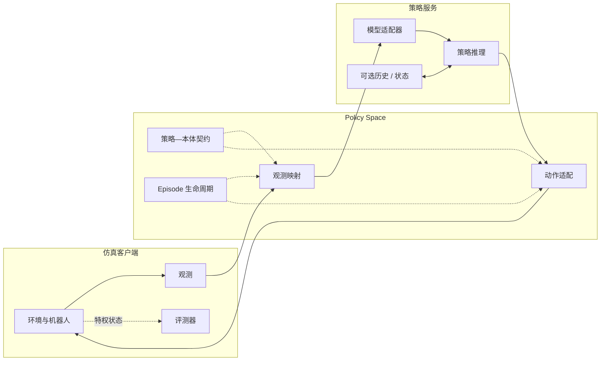

# 运行时架构

Policy Space 定义评测客户端与策略服务之间的运行边界。当前参考实现使用 ManaEnv 作为仿真客户端：客户端负责环境交互、机器人执行、任务配置、安全和评测；策略服务负责模型特定的预处理、推理以及可选历史或状态。Policy Space 使用版本化的观测、动作、本体和 episode 生命周期契约连接两端。

仓库首页使用 [`docs/assets/policy-space-runtime-overview.svg`](assets/policy-space-runtime-overview.svg) 中的论文级矢量图。下面的 Mermaid 源码提供同一结构的轻量可编辑版本。

## 运行职责

- **仿真客户端：** 生成观测、执行动作、推进环境并评测任务进度。
- **Policy Space：** 映射观测、适配动作、协商策略—本体契约并协调 episode 生命周期。
- **策略服务：** 将映射后的观测转换为模型原生输入、执行推理并维护可选历史或状态。

特权仿真状态只提供给评测器，不发送给策略服务。

未来真机部署也可以由机器人控制客户端实现同一协议。

[English](architecture.md)
